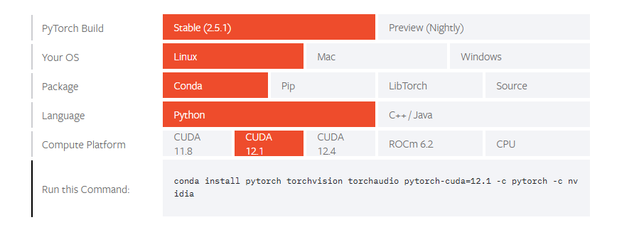
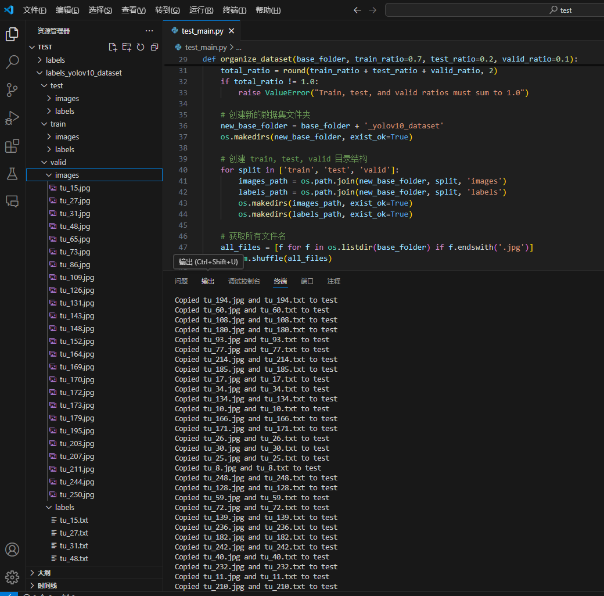
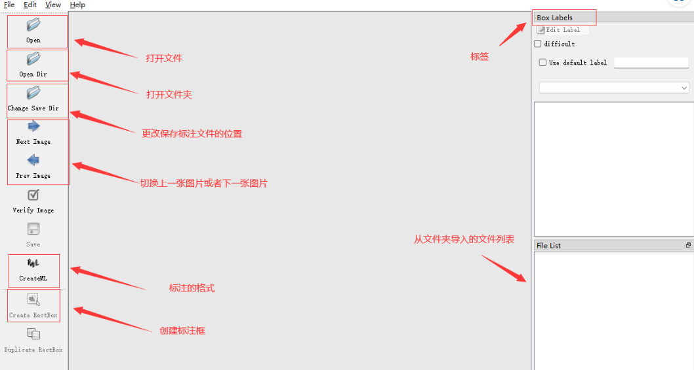

# 欢迎来到视觉项目指南！

## 配置yolov5
在上周的任务中，有一个任务是在 Anaconda 的一个虚拟环境内部署 yolov5。相信大家已经部署好了yolov5环境。如果没有完成的话，可以参考一下命令快速完成部署，以完成本周任务。


### 部署cpu版本
这个非常简单，进入你创建的conda环境，依次执行以下命令即可：
```bash
git clone https://github.com/ultralytics/yolov5  # clone repository
cd yolov5
pip install -r requirements.txt  # install dependencies
```

### 部署GPU版本
**这个的前提是你的电脑拥有NVidia显卡！！！**
在VMware中，虚拟机一般是无法直接调用实体机的显卡的。所以只能使用WSL和双系统。或者还有一个方案是在Windows和在VMware中同时部署，在Window中完成训练，在VMware的虚拟机中完成推理。

为了扫除下面的阅读障碍，这里简单介绍一下几个概念：
+ **GPU（显卡）**：显卡是我们平时说的GPU，现在大多数的电脑使用NVIDIA公司生产的显卡
+ **CUDA Driver**：这个是我们常说的显卡驱动，操作系统需要安装对应的显卡驱动才能使用显卡。
+ **CUDA**：CUDA是一种由NVIDIA推出的通用并行计算架构，该架构使GPU能够解决复杂的计算问题
+ **CUDA Toolkit**：CUDA工具包的主要包含了CUDA-C和CUDA-C++编译器、一些科学库和实用程序库、CUDA和library API的代码示例、和一些CUDA开发工具。（通常在安装CUDA Toolkit的时候会默认安装CUDA Driver；但是我们经常只安装CUDA Driver，没有安装CUDA Toolkit，因为有时不一定用到CUDA Toolkit；比如我们的笔记本电脑，安装个CUDA Driver就可正常看视频、办公和玩游戏了）
+ **NVCC**：其实就是CUDA的编译器,可以从CUDA Toolkit的/bin目录中获取,类似于gcc就是c语言的编译器
+ **CUDNN**： 是用于深度神经网络的GPU加速库；它强调性能、易用性和低内存开销。可以集成到高级别的机器学习框架中，如谷歌的Tensorflow、加州大学伯克利分校的流行caffe软件。

如果你使用的是双系统，会比使用WSL多一步，那就是安装显卡驱动，一般在双系统安装教程中有所涉及。从安装CUDA这一步开始，WSL和双系统的步骤有细微差别，整体步骤如下：
+ 安装CUDA，自行搜索教程
+ 安装CUDNN，自行搜索教程
+ 如果输入`nvcc -V`能够打印出CUDA版本说明CUDA安装成功
+ 创建conda虚拟环境，在环境中安装pytorch，在[这里](https://pytorch.org/get-started/locally/)选择合适的版本，参考如图
  
    然后复制命令运行  
    *！！注意：CUDA版本不能大于显卡驱动所能支持的最大版本（可以使用`nvidia-smi`命令查看）*
+ 验证安装，可以使用以下代码进行检验

    ```python
    import torch
    print(torch.cuda.is_available())
    ```
+ 然后安装其他依赖包即可

    ```bash
    git clone https://github.com/ultralytics/yolov5  # clone repository
    cd yolov5
    pip install -r requirements.txt  # install dependencies
    ```
*Tips:如果pip下载缓慢可以换源，上网自行搜索教程*

## 深度学习基本概念介绍

### 关于数据集
每个数据集由一个个样本组成，它们一般遵循独立同分布。通常每个样本由数据实例（可以理解为图片）和标签（可以理解为类别）组成。

数据集一般分为三种：
+ 训练集 (Training Set)：训练集是用来训练模型的数据集。模型通过学习训练集中的样本，逐步调整参数，优化模型的预测能力。
+ 验证集 (Validation Set)：验证集用于在训练过程中评估模型的性能，并用来调整模型的超参数（如学习率、正则化强度、网络层数等）。它与训练集是分开的，但又是模型在训练时能访问的。
+ 测试集 (Test Set)：测试集用于在模型训练和验证完全结束后评估模型的最终性能。它是模型在训练过程中没有见过的数据，用于模拟模型在实际应用中的表现。

### 进行本项目要了解的一些概念
+ 学习率（Learning Rate）：学习率是优化算法中的超参数，决定了模型在每次参数更新时的步长。学习率过大可能导致训练不稳定，学习率过小则可能导致收敛速度过慢。
+ 批量大小（Batch Size）：批量大小是指每次迭代时用于计算梯度的训练样本数。
+ Epoch：Epoch 是指在训练过程中，整个训练数据集经过神经网络一次完整的前向传播和反向传播过程。在一个 epoch 中，神经网络会从训练数据中获取信息，计算损失并更新模型的权重。通常，训练过程会包括多个 epoch，直到模型在验证集上的性能达到预期为止。如果训练 epoch 数量过多，可能会导致模型过拟合训练数据，即在训练集上表现良好，但在新数据（验证集或测试集）上表现不佳。
+ 权重（Weights）：权重是神经网络中的可训练参数，它们决定了神经元之间的连接强度。每个神经元与前一层神经元之间的连接都会有一个权重，权重值的大小影响了输入信号的传递强度。神经网络通过这些权重来调整输出结果，使得输出更接近实际目标。

**其他概念自行阅读其他资料。深度学习是一门很深的学问，这个项目只是让大家对其有一个初步的体会，无需深究。**

## 标注工具的使用

### 标注的作用

深度学习的数据集是需要我们事先准备好的，人工智能有多少智能，就要有多少人工

准备数据集的过程大概就是标注

然后在标注完的数据集通常需要进行脚本处理，以便将数据集分类为训练集、验证集和测试集
这个过程包括以下步骤：

1. **突然有需求要批量处理数据集**：比如在标注完图片之后，突然发现要把图片进行随机的光照处理、加上随机的高斯噪声之类的，不可能人工再重新标注一次，这时候得要借助脚本和标注文件的格式进行一些奇技淫巧来达到废物利用的效果
    - 比如标注时标签是中文，可是要用英文该咋办
    - 可以对标注工具导出前的标注文件的数据格式进行处理，处理完再导出，这里是用 x-anlylabeling，在导出给 yolo 用前的数据文件是以 json 格式存储的，使用 py 脚本批处理即可


2. **数据集分割成上述三个集**：将数据集分割为训练集、验证集和测试集，通常按照一定的比例进行分割（例如 70% 训练集，20% 验证集，10% 测试集）这也需要在导出所有标注文件之后使用脚本分类处理
    - 比如下面的场景，把图片和标注信息文件分类
    - 还有把数据集按比例分类成上述三个部分


### 使用经典标注工具 labelimg

#### 安装
使用以下命令进行安装：
```bash
pip install labelimg -i https://pypi.tuna.tsinghua.edu.cn/simple
```
#### 使用

在命令行输入以下命令
```bash
labelImg
```
界面如下：


把标注格式改为yolo即可

更加具体的使用可以参考<https://blog.csdn.net/StopAndGoyyy/article/details/139906637>

### 使用 x-anylabeling

上面的标注工具是经典的手动标注工具，这里有一种新的思路，就是先使用手动标注的数据集做个小模型，然后写个脚本用小数据集的模型来代替你去识别图片
- 如果能认出来的话就用识别结果导出成标注的文件
- 认不出来的自动另存，再手动标注一下然后重新训练（太多认不出来的，可以取部分来标注），训练出来的模型再跑新的图片，重复做几次就完善了
- 这样就可以大大减少人工标注的工作量

这里的 x-anylabeling 就实现了上述的一部分功能，可以导入训练好的模型进行自动标注
当然，这个标注工具也像 labelimg 一样支持手动标注


下是这个项目的 github地址
- [X-AnyLabeling/docs/zh_cn/get_started.md at main · CVHub520/X-AnyLabeling](https://github.com/CVHub520/X-AnyLabeling/blob/main/docs/zh_cn/get_started.md)
- [X-AnyLabeling/docs/zh_cn/user_guide.md at main · CVHub520/X-AnyLabeling](https://github.com/CVHub520/X-AnyLabeling/blob/main/docs/zh_cn/user_guide.md)
- 注意，直接安装二进制文件印象中好像只支持默认的人工标注功能，要想有导入模型进行自动化标注，需要克隆源码进行编译
- 编译时也有 GPU 加速的版本和只使用 CPU 的版本，按需下载安装二进制文件或者编译即可

视频教程
- [【YOLO】X-AnyLabeling自动标注工具,AI帮你解放双手_哔哩哔哩_bilibili](https://www.bilibili.com/video/BV12c46eUE4o/?spm_id_from=333.337.search-card.all.click&vd_source=9c85d181a345808c304a6fa2780bb4da)

## 数据集的训练

将数据集`dataset.zip`解压，放在你部署的yolov5的根目录里面。数据集`dataset`的组成：
+ images:图片
+ labels:图片对应的标签

标签格式如下：
```
<class_id> <x_center> <y_center> <width> <height>
```
+ class_id: 目标的类别ID，从0开始计数。每个类别对应一个整数索引。
+ x_center: 目标边界框中心点的 x 坐标，归一化到[0, 1]范围，即相对于图像的宽度。
+ y_center: 目标边界框中心点的 y 坐标，归一化到[0, 1]范围，即相对于图像的高度。
+ width: 目标边界框的宽度，归一化到[0, 1]范围，即相对于图像的宽度。
+ height: 目标边界框的高度，归一化到[0, 1]范围，即相对于图像的高度。

先进入`dataset`目录，运行命令：
```bash
python process_data.py
```
运行这个脚本的目的是把数据集打乱和分割成训练集、验证集和测试集。同时生成images对应的路径。运行后会在`dataset`目录下生成以下文件/文件夹：
+ `test`
+ `train`
+ `val`
+ `train.txt`
+ `val.txt`
+ `test.txt`

然后进入到项目的根目录（即yolo文件夹下）,运行如下命令即可开始训练：
```bash
python train.py --data ./dataset/config.yaml
```
在`train.py`中有许多命令行参数可以配置，如图：


下面对一些比较重要的参数讲解，其他自行翻译或上网查阅：
+ `--weights`：指定初始权重的路径（通常为预训练的模型权重）。默认是 yolov5s.pt，即 YOLOv5 小版本的预训练模型。
+ `--data`：指定数据集配置文件路径（.yaml 文件）。默认是 coco128.yaml，指向一个包含数据集配置（如类名、数据路径等）的 YAML 文件。
+ `--hyp`：指定超参数文件路径（.yaml 文件），例如学习率、批量大小等训练相关的超参数。默认是 hyp.scratch-low.yaml。
+ `--epochs`：训练的总周期数。默认是 50。
+ `--batch-size`：总批量大小（对所有GPU的合并批量），如果是 -1，则使用自动批量。
+ `--imgsz`,` --img`, `--img-size`：指定训练和验证时图像的尺寸（像素）。默认是 640。

如果显卡配置比较低可以把epochs和batch_size调小一点。也可以把图像尺寸调小一点。例如，命令
```bash
python train.py --data ./dataset/config.yaml --epochs 40 --batch-size 16
```
的含义就是使用我们给出的数据集，epochs为40，batch size为16训练模型。  

关于python命令行参数更加具体的使用可以参考这篇博客：<https://liangbm3.top/2024/10/29/python%E5%86%85%E7%BD%AE%E5%BA%93argparse%E7%9A%84%E4%BD%BF%E7%94%A8/>

训练完成后，会打印训练结果，同时在runs文件夹也会有相应结果。

## 使用权重进行推理
训练完成后会得到权重，我们可以使用权重来推理预测新的图片。例如：
```bash
python detect.py --weights ./runs/train/exp6/weights/best.pt  --source ./dataset/test/images/
```
这个命令就是使用训练得到的权重，对测试集文件夹下的所有图片进行推理。推理结果一般在`runs/detect/`文件夹下。

命令
```bash
```bash
python detect.py --weights ./runs/train/exp6/weights/best.pt  --source 0
```
会调用电脑摄像头对视频流进行实时推理。


